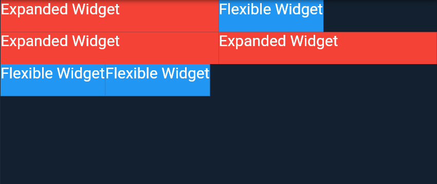

<div align="center">
  
  <h1>Flutter Interview Questions</h1>

---

<span>This repository contains common Flutter interview questions and their answers.🚀 From basic to advanced, test your understanding of Flutter and Dart, brush up on your knowledge 💪, or get ready for your next coding interview! I add new questions to this repository on a regular basis (along with answers 😉). Best of luck to all of you. ❤ Last updated: <a href=#20230318><b>Feb 18th, 2023</b></a>
</span>

Feel free to reach out to me! 😊 <br />
<a href="https://www.instagram.com/thecodexhub">Instagram</a> || <a href="https://www.twitter.com/thecodexhub">Twitter</a> || <a href="https://www.linkedin.com/in/sandippramanik">LinkedIn</a> || <a href="https://www.medium.com/@thecodexhubofficial">Medium Blog</a>
</div>

| If you find this repository useful, kindly give it a star ⭐ 💪🏼 Thank you and have fun! |

<hr />

| Sl no |  Questions       |
|-------|------------------|
| 01 |[What is Flutter?](#q1-what-is-flutter)|
| 02 |[What is Dart and Why does Flutter use it?](#q2-what-is-dart-and-why-does-flutter-use-it)|
| 03 |[What is `pubspec.yaml` file and what does it do?](#q3-what-is-pubspecyaml-file-and-what-does-it-do)|
| 04 |[What is the difference between `main()` and `runApp()` functions in Flutter?](#q4-what-is-the-difference-between-main-and-runapp-functions-in-flutter)|
| 05 |[Differentiate between named parameters and positional parameters in Flutter.](#q5-differentiate-between-named-parameters-and-positional-parameters-in-flutter)|
| 06 |[What are widgets in Flutter?](#q6-what-are-widgets-in-flutter)|
| 07 |[What is `Hot Reload` and `Hot Restart` in Flutter?](#q7-what-is-hot-reload-and-hot-restart-in-flutter)|
| 08 |[What do you mean by open-source software? Is Flutter open-source?](#q8-what-do-you-mean-by-open-source-software-is-flutter-open-source)|
| 09 |[Differentiate between `StatelessWidget` and `StatefulWidget` in Flutter.](#q9-differentiate-between-statelesswidget-and-statefulwidget-in-flutter)|
| 10 |[What is `BuildContext` in Flutter? And why is it needed?](#q10-what-is-buildcontext-in-flutter-and-why-is-it-needed)|
| 11 |[What are packages and plugins in Flutter?](#q11-what-are-packages-and-plugins-in-flutter)|
| 12 |[Name some popular apps made with Flutter.](#q12-name-some-popular-apps-made-with-flutter)|
| 13 |[What are different build modes in Flutter?](#q13-what-are-different-build-modes-in-flutter)|
| 14 |[What is the difference between `WidgetsApp` and `MaterialApp` in Flutter?](#q14-what-is-the-difference-between-widgetsapp-and-materialapp-in-flutter)|
| 15 |[Differentiate between final, const and static keyword.](#q15-differentiate-between-final-const-and-static-keyword)|
| 16 |[What are `StatefulWidget` Lifecycle methods. Explain briefly.](#q16-what-are-statefulwidget-lifecycle-methods-explain-briefly)|
| 17 |[What are keys and why do we need them?](#q17-what-are-keys-and-why-do-we-need-them)|
| 18 |[What is the difference between `Expanded` and `Flexible` widget?](#q18-what-is-the-difference-between-expanded-and-flexible-widget)|
| 19 |[What is Fat Arrow Notation in Dart?](#q19-what-is-fat-arrow-notation-in-dart)|
| 20 |[What is the purpose of `SafeArea` widget in Flutter?](#q20-what-is-the-purpose-of-safearea-widget-in-flutter)|
| 21 |[What are `Slivers`?](#q21-what-are-slivers)|
| 22 |[What is the extension method in Dart?](#q22-what-is-the-extension-method-in-dart)|
| 23 |[Explain the `mounted` property. How is it important and when to use it?](#q23-explain-the-mounted-property-how-is-it-important-and-when-to-use-it)|
| 24 |[What is sound null safety?](#q24-what-is-sound-null-safety)|
| 25 |[Differentiate between `mainAxisAlignment` and `crossAxisAlignment`.](#q25-differentiate-between-mainaxisalignment-and-crossaxisalignment)|
| 26 |[What are mixins? How to use them?](#q26-what-are-mixins-how-to-use-them)|
| 27 |[What is the difference between `Container` and `SizedBox` widget?](#q27-what-is-the-difference-between-container-and-sizedbox-widget)|
| 28 |[What do you mean by Null-aware operators?](#q28-what-do-you-mean-by-null-aware-operators)|
| 29 |[What is `AppLifecycleState`?](#q29-what-is-applifecyclestate)|
| 30 |[What is the difference between `NetworkImage` and `Image.network` in flutter?](#q30-what-is-the-difference-between-networkimage-and-imagenetwork-in-flutter)|
| 31 |[Explain async, await and Future.](#q31-explain-async-await-and-future)|
| 32 |[What is `resizeToAvoidBottomInset`? When should we use it?](#q32-what-is-resizetoavoidbottominset-when-should-we-use-it)|
| 33 |[What is `TextEditingController`?](#q33-what-is-texteditingcontroller)|
| 34 |[What is `Animation` and `AnimationController`?](#q34-what-is-animation-and-animationcontroller)|
| 35 |[What is `InheritedWidget` in Flutter?](#q35-what-is-inheritedwidget-in-flutter)|
| 36 |[What is Flutter Tree Shaking?](#q36-what-is-flutter-tree-shaking)|
| 37 |[What is an `AspectRatio` widget used for?](#q37-what-is-an-aspectratio-widget-used-for)|
| 38 |[What is `vsync`? Explain.](#q38-what-is-vsync-explain)|
| 39 |[Differentiate between `Stream` and `Future` in Flutter.](#q39-differentiate-between-stream-and-future-in-flutter)|
| 40 |[What is `assert` used for in Dart and Flutter?](#q40-what-is-assert-used-for-in-dart-and-flutter)|
| 41 |[Can you explain the process of creating custom widgets in Flutter?](#q41-can-you-explain-the-process-of-creating-custom-widgets-in-flutter)|
| 42 |[What is Typedef in Dart?](#q42-what-is-typedef-in-dart)|
| 43 |[What is `FutureBuilder` in Flutter and how is it used to build dynamic UI?](#q43-what-is-futurebuilder-in-flutter-and-how-is-it-used-to-build-dynamic-ui)|
| 44 |[How do you handle exceptions in Flutter, and what strategies have you used?](#q44-how-do-you-handle-exceptions-in-flutter-and-what-strategies-have-you-used)|
| 45 |[What is isolate in Flutter?](#q45-what-is-isolate-in-flutter)|
| 46 |[What are DevTools in Flutter?](#q46-what-are-devtools-in-flutter)|
| 47 |[How would you make HTTP requests in the Flutter framework?](#q47-how-would-you-make-http-requests-in-the-flutter-framework)|
| 48 |[What is Factory constructor?](#q48-what-is-factory-constructor)|
| 49 |[Can you explain the process of testing a Flutter app?](#q49-can-you-explain-the-process-of-testing-a-flutter-app)|
| 50 |[Explain singleton class in flutter.](#q50-explain-singleton-class-in-flutter)|
| 51 |[What technology is Flutter built with?](#q51-what-technology-is-flutter-built-with)|
| 52 |[What is the event loop?](#q52-what-is-the-event-loop)|
| 53 |[What is the difference between Provider vs. InheritedWidget?](#q53-what-is-the-difference-between-provider-vs-inheritedwidget)|
| 54 |[What is the purpose of the `initState()` method in a StatefulWidget?](#q54-what-is-the-purpose-of-the-initstate-method-in-a-statefulwidget)|
| 55 |[What is the purpose of the `dispose()` method in a StatefulWidget?](#q55-what-is-the-purpose-of-the-dispose-method-in-a-statefulwidget)|
| 56 |[What is a GlobalKey in Flutter?](#q56-what-is-a-globalkey-in-flutter)|
| 57 |[What is the difference between padding and margin in Flutter?](#q57-what-is-the-difference-between-padding-and-margin-in-flutter)|
| 58 |[What is the purpose of the scaffold widget in Flutter?](#q58-what-is-the-purpose-of-the-scaffold-widget-in-flutter)|
| 59 |[What is the purpose of the Expanded widget in Flutter?](#q59-what-is-the-purpose-of-the-expanded-widget-in-flutter)|
| 60 |[How do you handle user input in Flutter?](#q60-how-do-you-handle-user-input-in-flutter)|

<br />
<hr />

## Q1. What is Flutter?

Flutter is an open-source UI software development kit created by Google. It is used to develop cross platform applications for Android, iOS, Linux, macOS, Windows, and the web from a single codebase. Flutter was released in May 2017. Developers consider it as the fastest and most expressive way to create native apps. Flutter will have a significant impact on the development of high-quality, feature-packed mobile applications in the near future due to its simplicity, high performance as a result of its development, and rich user interface.

<div align="right">
    <b><a href="#flutter-interview-questions">⮬ back to top</a></b>
</div>

## Q2. What is Dart and Why does Flutter use it?

Dart is a programming language designed for client development, such as for the web and mobile apps. It is developed by Google and can also be used to build server and desktop applications. It is an object-oriented, class-based, garbage-collected language with C-style syntax.

* Dart allows Flutter to avoid the need for a separate declarative layout language like JSX or XML, or separate visual interface builders, because Dart's declarative, programmatic layout is easy to read and visualize.
* Dart uses the Just In Time compilation. This drastically reduces the time of development and responds faster.

<div align="right">
    <b><a href="#flutter-interview-questions">⮬ back to top</a></b>
</div>

## Q3. What is `pubspec.yaml` file and what does it do?

Every Flutter project includes a `pubspec.yaml` file, which is generated while creating a new Flutter project. It’s located at the top of the project tree and contains metadata about the project that the Dart and Flutter tooling needs to know.

The pubspec file specifies dependencies that the project requires, such as particular packages (and their versions), fonts, or image files. It also specifies other requirements, such as dependencies on developer packages (like testing or mocking packages), or particular constraints on the version of the Flutter SDK.

<div align="right">
    <b><a href="#flutter-interview-questions">⮬ back to top</a></b>
</div>

## Q4. What is the difference between `main()` and `runApp()` functions in Flutter?

The `main()` function tells Dart where the program starts, and it must be in the file that is considered the "entry point" for the program. By convention, this will be in a file called `main.dart`. This main function can execute any code within it's code block.

The `runApp()` function should return widget that would be attached to the screen as a root of the widget tree that will be rendered.

<div align="right">
    <b><a href="#flutter-interview-questions">⮬ back to top</a></b>
</div>

## Q5. Differentiate between named parameters and positional parameters in Flutter.

A `Positional Parameter` is linked by its position. Positional parameters must be specified in the order in which they appear. `Named Parameters` are referenced by name, which means that they can be used during the function invocation in an order different from the function declaration.

To declare a positional optional parameter, we use square brackets `[ ]`, whereas to declare a named optional parameters we use curly braces `{ }`.

```dart
doSomething(String name, [String greeting = 'Hello']); // Positional Optional Parameter
doSomething({String? name, String greeting = 'Hello'}); // Named Optional Parameter
```

<div align="right">
    <b><a href="#flutter-interview-questions">⮬ back to top</a></b>
</div>

## Q6. What are widgets in Flutter?

Widgets are the central class hierarchy in the Flutter framework, that describes the configuration of an element to manage the underlying render tree. A widget is an immutable description of part of a user interface. Widgets themselves have no mutable state, i.e., all their fields must be final.

In Flutter, everything is a widget.

<div align="right">
    <b><a href="#flutter-interview-questions">⮬ back to top</a></b>
</div>

## Q7. What is `Hot Reload` and `Hot Restart` in Flutter?

Flutter's `Hot Reload` feature injects the updated source code files into the running **Dart Virtual Machine (VM)**, and rebuilds the widget tree preserving the app state to quickly view the effects of the changes.

Whereas `Hot Restart` loads the updated source code files into the VM and restarts the Flutter app, losing all the previous app states.

<div align="right">
    <b><a href="#flutter-interview-questions">⮬ back to top</a></b>
</div>

## Q8. What do you mean by open-source software? Is Flutter open-source?

Open-source software is software with with source code that anyone can inspect, modify, and enhance. Open-source software is developed in a decentralized and collaborative way, relying on peer review and community production. Open source software is often cheaper, more flexible, and has more longevity than its proprietary peers because it is developed by communities rather than a single author or company.

Yes, Flutter is an open-source software development kit.

<div align="right">
    <b><a href="#flutter-interview-questions">⮬ back to top</a></b>
</div>

## Q9. Differentiate between `StatelessWidget` and `StatefulWidget` in Flutter.

`StatelessWidget`s are those that do not change, or are immutable. Its appearance and properties remain constant throughout the widget's lifetime. **Icon**, **IconButton**, **Text** are examples of stateless widgets.

`StatefulWidget`s are those that change their properties while running. They are dynamic, which means they can be rebuilt multiple times during their lifetime. It can alter its appearance in response to events caused by the user interactions or when data is received. **Checkbox**, **Radio**, **Slider**, **InkWell**, **Form**, and **TextField** are examples of stateful widgets.

<div align="right">
    <b><a href="#flutter-interview-questions">⮬ back to top</a></b>
</div>

## Q10. What is `BuildContext` in Flutter? And why is it needed?

`BuildContext` is a locator that tracks and locates each widget in a widget tree. `BuildContext` objects are passed to **WidgetBuilder** functions, and are available from the `State.context` member. Some static functions (e.g. **showDialog**, **Theme.of**, and so forth) also take build contexts so that they can act on behalf of the calling widget, or obtain data specifically for the given context.

There are many reasons why `BuildContext` is important. From locating widgets in the tree to interacting with **RenderObjects**, the context makes all of these interactions possible. It serves as the **bridge** between the widgets and rendering layer and is especially powerful for combining functionality or using information from one tree in another.

<div align="right">
    <b><a href="#flutter-interview-questions">⮬ back to top</a></b>
</div>

## Q11. What are packages and plugins in Flutter?

A package only contains Dart code. Some of the packages may use Flutter specific functionality and thus have a dependency on the Flutter framework.

A plugin contains Dart combined with one or more platform-specific native (Java/Swift/JavaScript) code. The API of the plugin is written in Dart and the implementations are written in native languages. Flutter uses platform channels to communicate with native codes.

<div align="right">
    <b><a href="#flutter-interview-questions">⮬ back to top</a></b>
</div>

## Q12. Name some popular apps made with Flutter.

- BMW
- Google Pay
- Alibaba
- Beika
- Dream11
- eBay
- Nubank
- Reflectly
- Rive
- Toyota
- Tencent
- Hamilton
- iRobot

_Source: [here](https://flutter.dev/showcase)_

<div align="right">
    <b><a href="#flutter-interview-questions">⮬ back to top</a></b>
</div>

# Q13. What are different build modes in Flutter?

The Flutter tooling supports three different build modes while compiling the app. We need to choose the build mode depending upon where we are in the development cycle.

- `debug`: For development purpose, the **hot reload** feature is enabled only in the debug mode.
- `profile`: For analyzing the app performance. We use DevTools suite to profile app's performance.
- `release`: For releasing the app when everything is ready.

_To learn more, check [docs](https://docs.flutter.dev/testing/build-modes)._

<div align="right">
    <b><a href="#flutter-interview-questions">⮬ back to top</a></b>
</div>

## Q14. What is the difference between `WidgetsApp` and `MaterialApp` in Flutter?

`WidgetsApp` is a convenient widget that wraps a number of widgets that are commonly required for an application. It also provides basic navigation.

`MaterialApp` builds an application that uses the mterial design. It is built upon the `WidgetsApp` and contains some material-design specific functionality, such as **AnimatedTheme**. We certainly don't require `MaterialApp` every time when building a Flutter project. `CupertinoApp` gives iOS like look and feel, or we can even define our custom sets of widgets. 

<div align="right">
    <b><a href="#flutter-interview-questions">⮬ back to top</a></b>
</div>

## Q15. Differentiate between final, const and static keyword.

The `final` keyword defines a variable that can be initialized once and cannot be changed after being assigned a value for the first time.

The `const` keyword defines a constant variable that should not be changed over time.

Now the only difference between the final and const variable is that **final is a runtime-constant**, which in turn means that its value can be assigned at runtime instead of the compile-time that we had for the const keyword.

The `static` keyword is used for a class-level variable and method that is the same for every instance of a class, this means if a data member is static, it can be accessed without creating an object. The static keyword allows data members to persist Values between different instances of a class.

<div align="right">
    <b><a href="#flutter-interview-questions">⮬ back to top</a></b>
</div>

## Q16. What are `StatefulWidget` Lifecycle methods. Explain briefly.

- **createState() method:** Whenever a StatefulWidget is created, the framework calls this method to create fresh State objects. This method must be overridden.

- **initState() method:** This method is the first method that is called while creating a StatefulWidget class. Here we allocate our resources, which means we can initialize our variable, data, and properties.

- **didChangeDependencies() method:** This method is called just after initState() method when a dependency of this State object changes. For example, if the previous build was referencing an InheritedWidget that changes, this method notifies the object to change.

    Generally, subclasses don't override didChangeDependencies() method because the framework calls build() methods after dependency change. But to do some expensive work, let's say some network calls, the method is preferred over doing everything on build() method itself.

- **build() method:** Every time the widget is rebuilt, the build() method is used. This can happen after calling initState(), didChangeDependencies(), or didUpdateWidget(), or after changing the state with a call to setState().

- **didUpdateWidget() method:** This method is called whenever the widget configuration changes. This method exists for triggering side-effects when one of the parameters in the StatefulWidget changes. A typical example is implicitly animated widgets.

- **setState() method:** This method notifies the framework that the internal state of this object has changed. The provided callback must be synchronous which might impact the user interface in the subtree. The framework schedules a build() for this current State object.

- **deactivate() method:** The framework calls this method when the State is removed from the tree, temporarily or permanently.

- **dispose() method:** This method is called when the State is removed from the tree, permanently. After the dispose() method is called, the State object is considered unmounted. Subclasses should override this method to release any resources retained by this object.

<div align="right">
    <b><a href="#flutter-interview-questions">⮬ back to top</a></b>
</div>

## Q17. What are keys and why do we need them?

Flutter uses keys to preserve the state and to uniquely identify specific widgets within a widget tree. It is used to preserve the state of the `StatefulWidget`s while they are being replaced with other widgets or just moved in the widget tree.

The most common usage of key is when we are dealing with collections of widgets that have the same type; so, without keys, the element tree would not know which state corresponds to which widget, as they would all have the same type.

For an explanation with an example, check this [stackoverflow answer](https://stackoverflow.com/a/50081052).

<div align="right">
    <b><a href="#flutter-interview-questions">⮬ back to top</a></b>
</div>

## Q18. What is the difference between `Expanded` and `Flexible` widget?

The only difference between these two widgets is the `Flexible` widget takes only the space needed by the child, whereas the `Expanded` widget enforces its child to take all the available space.

The `Expanded` widget in flutter is shorthand of `Flexible` with the fit set to **FlexFit. tight**.

```dart
Column(children: [
  Row(
    children: [_ExpandedWidget(), _FlexibleWidget()],
  ),
  Row(
    children: [_ExpandedWidget(), _ExpandedWidget()],
  ),
  Row(
    children: [_FlexibleWidget(), _FlexibleWidget()],
  ),
]),
```

<p align="center">
  
</p>

<div align="right">
    <b><a href="#flutter-interview-questions">⮬ back to top</a></b>
</div>

## Q19. What is Fat Arrow Notation in Dart?

A fat arrow (=>) is used to define a single expression in a function. This is a cleaner way to write functions with a single statement.

Syntax:

```
ReturnType FunctionName(Params) => Expression;
```

Example:

```dart
// Without fat arrow notation
String findSquare(int n) {
  return 'The square of $n is ${n * n}.';
}

// With fat arrow notation
String findSquare(int n) => 'The square of $n is ${n * n}.';
```

<div align="right">
    <b><a href="#flutter-interview-questions">⮬ back to top</a></b>
</div>

## Q20. What is the purpose of `SafeArea` widget in Flutter?

The `SafeArea` widget insets its child by sufficient padding to avoid intrusions by the operating system. For example, this will indent the child by enough to avoid the status bar at the top of the screen. It will also indent the child by the amount necessary to avoid the Notch, or similar creative physical features of the display.

<div align="right">
    <b><a href="#flutter-interview-questions">⮬ back to top</a></b>
</div>

## Q21. What are `Slivers`?

A sliver is a portion of a scrollable area that you can define to behave in a special way. You can use slivers to achieve custom scrolling effects, such as elastic scrolling.

Under the hood, slivers are used to implement all of the scrollable views you use, including ListView and GridView. Slivers can be compared to a lower-level interface that offers more precise control over the implementation of scrollable areas.

Sliver lets you render child widgets lazily or render only the visible segment of the screen. Additionally, Sliver provides a better experience when you need to scroll a list of items and a grid of items all together as a single unit or create a collapsible header. It makes the overall scrolling effect of large lists effective and efficient.

<div align="right">
    <b><a href="#flutter-interview-questions">⮬ back to top</a></b>
</div>

## Q22. What is the extension method in Dart?

Extension method allows us to add new functionality on top of existing libraries.For example, you can add extra functionality to the Dart core String library, that are only available in your app.

Syntax to create an extension method:

```
extension <extension name> on <type> {
  // (<member definition>)*
}
```

Example of an Dart extension method:

```dart
// an extension method
extension StringExtension on String {
  String capitilizeWord() {
    return this.split(' ').map((word) => word[0].toUpperCase() + word.substring(1)).join(' ');
  }
}

// example of using the above extension
String myString = 'welcome to the flutter world!!!';
print(myString.capitilizeWord()); // Welcome To The Flutter World!!!
```

Here is how we can unleash the power of extension methods in Flutter:

```dart
// an extension on widget
extension WidgetExtension on Widget {
  Widget addPadding([double padding = 8.0]) {
    return Padding(
      padding: EdgeInsets.all(padding),
      child: this,
    );
  }
}

// example of using the above extension
Text('Text widget with the default padding of 8.0').addPadding();
Text('Text widget with padding of 16.0').addPadding(16.0);
```

<div align="right">
    <b><a href="#flutter-interview-questions">⮬ back to top</a></b>
</div>

## Q23. Explain the `mounted` property. How is it important and when to use it?

The mounted property defines whether the state object, associated with it, is currently in the widget tree.

After creating a State object and before calling initState, the framework **"mounts"** the State object by associating it with a BuildContext. The State object remains mounted until the framework calls dispose, after which time the framework will never ask the State object to build again.

It is an error to call setState unless mounted is true. This property is useful when a method on your state calls setState() but it isn't clear when or how often that method will be called. You can use `if (mounted) {...` to make sure the State exists before calling setState().

<div align="right">
    <b><a href="#flutter-interview-questions">⮬ back to top</a></b>
</div>

## Q24. What is sound null safety?

**Sound null safety** makes types in code non-nullable by default and enables special static checks and compiler optimizations to guarantee that null-dereference errors won't appear at runtime because they will be spotted at compile-time and fixed.

**Null safety** is a guarantee within an object-oriented programming language that no object references will have null or void values.

<div align="right">
    <b><a href="#flutter-interview-questions">⮬ back to top</a></b>
</div>

## Q25. Differentiate between `mainAxisAlignment` and `crossAxisAlignment`.

The `mainAxisAlignment` determines how the children should be placed along the main axis in a flex layout. Whereas, the `crossAxisAlignment` determines how the children will be placed along the cross axis in a flex layout.

For a `Row` widget: 
- **mainAxisAlignment** --> Horizontal axis
- **crossAxisAlignment** --> Vertical axis

<p align="center">
  
</p>

For a `Column` widget: 
- **mainAxisAlignment** --> Vertical axis
- **crossAxisAlignment** --> Horizontal axis

<p align="center">
  
</p>

_Image source: [Flutter Docs](https://docs.flutter.dev/development/ui/layout#aligning-widgets)_

<div align="right">
    <b><a href="#flutter-interview-questions">⮬ back to top</a></b>
</div>

## Q26. What are mixins? How to use them?

A mixin is a class whose methods and properties can be used by other classes – without subclassing. It's a reusable chunk of code that can be plugged in to any class that needs this functionality.

Example of a mixin:

```dart
// To create a mixin, use `mixin` keyword instead of `class`.
mixin GreetingsMixin {
  String greeting = 'Hello people';

  void introduce() => print('$greeting, I am Sandip.');
}

// The following example shows two classes that use the above mixin.
class Something extends MyClass with GreetingsMixin {
  // ...
}

class SomethingElse extends MyAnotherClass with GreetingsMixin {
  SomethingElse() {
    greeting = 'Hi everyone';
  }
}

// Here is how to use them
SomethingElse obj = SomethingElse();
obj.introduce();  // Hi everyone, I am Sandip.
```

Sometimes you want to restrict from mixing in functionality to classes that have no deal with the mixin. To restrict a mixin, use the 'on' keyword to specify the required subclass.

```dart
class SocialMedia {
  // ...
}

// Create a mixin restricted on [SocialMedia] class
mixin SocialMediaGreetings on SocialMedia {
  String greeting = 'Hello people';

  void introduce() => print('$greeting, I am Sandip.');
}

// Only classes that extend or implement the [SocialMedia] class
// can use the mixin [SocialMediaGreetings]
class Twitter extends SocialMedia with SocialMediaGreetings {
  Twitter() {
    greeting = 'Hello Tweeple';
  }
}
```

<div align="right">
    <b><a href="#flutter-interview-questions">⮬ back to top</a></b>
</div>

## Q27. What is the difference between `Container` and `SizedBox` widget?

**SizedBox** is a widget for giving some constant height or width between two widgets. It does not contain any decorative properties just like color, shape, borderRadius etc.

On the other hand **Container** is a widget that any person can modify according to their needs.

When used for whitespace, there is a linter warning to prefer SizedBox instead of Container. Because a Container is a heavier widget than a SizedBox, and as bonus, SizedBox has a const constructor, so it won't even create a new instance during runtime.

<div align="right">
    <b><a href="#flutter-interview-questions">⮬ back to top</a></b>
</div>

## Q28. What do you mean by Null-aware operators?

Null aware operator allows us to make computations based on whether or not a value is null.

Example of null-aware operators are:

- **Optional Chaining Operator (?.):**

  We use ?. when we want to call a method/getter on an object if and only if that object is not null (otherwise, return null).

  ```dart
  String? name = user?.name;

  // This code is same as
  // String? name = (user == null) ? null : user.name;
  ```

- **Default Operator (??):**

  We use ?? when you want to evaluate and return an expression if another expression resolves to null. It is also called the **if-null operator** and **coalescing operator**. The null-aware operator is ??, which returns the expression on its left unless that expression’s value is null. In which case it’s null it returns the expression on its right.

  ```dart
  String? hello;
  String? greeting = hello ?? 'Hey';

  // This code is same as
  // String? greeting = (hello == null) ? 'Hey' : hello;
  ```

- **Logical Nullish Assignment (??=):**

  We use ??= when we want to assign a value to an object if that object is null. Otherwise, it returns the object.

  ```dart
  int? x;
  x ??= 3;  // Assigns 3 to the variable `x`
  x ??= 5;  // As x is not null now, it's value is still 3
  ```

<div align="right">
    <b><a href="#flutter-interview-questions">⮬ back to top</a></b>
</div>

## Q29. What is `AppLifecycleState`?

The `AppLifecycleState` defines the state that an application can be.

- **detached (AppLifecycleState.detached):** This means the application is still hosted on flutter engine but is detached from any host views. It can either be in the progress of attaching a view when engine was first initializes, or after the view being destroyed due to a Navigator pop.

- **inactive (AppLifecycleState.inactive):** This means the application is in an inactive state and is not receiving user input. Simply we can say the app is in the foreground and not running in the background on your mobile phone.

- **paused (AppLifecycleState.paused):** This means the application is not currently visible to the user, not responding to user input, and running in the background.

- **resumed (AppLifecycleState.resumed):** This means the application is visible and responding to user input.

<div align="right">
    <b><a href="#flutter-interview-questions">⮬ back to top</a></b>
</div>

## Q30. What is the difference between `NetworkImage` and `Image.network` in flutter?

`NetworkImage` class creates an object that provides an image from the src URL passed to it. It is not a widget and does not output an image to the screen.

`Image.network` creates a widget that displays an image on the screen. It is just a named constructor on the **Image** class. It sets the image property using the **NetworkImage** . This image property is then used to display the image.

<div align="right">
    <b><a href="#flutter-interview-questions">⮬ back to top</a></b>
</div>

## Q31. Explain async, await and Future.

The `async` and `await` are keywords in Dart that enable asynchronous programming. They make it easier to write asynchronous code that is readable and easier to maintain.

`Future` is a core Dart library that represents an asynchronous operation that will complete in the future. A `Future` object is returned from an asynchronous function to represent a value that will be available at some point in the future.

In Flutter, `async` and `await` are used to perform asynchronous operations, such as making HTTP requests or reading from a database. The Future object is used to represent the result of an asynchronous operation and is often passed to await in an async function to wait for the result to be available.

```dart
Future<String> fetchData() async {
  // Asynchronous operation
  return 'Data';
}

void main() async {
  String data = await fetchData();
  print(data);
}
```

<div align="right">
    <b><a href="#flutter-interview-questions">⮬ back to top</a></b>
</div>

## Q32. What is `resizeToAvoidBottomInset`? When should we use it?

The `resizeToAvoidBottomInset` is a property in the `Scaffold` widget. It is a boolean property that determines whether the body of the `Scaffold` should be resized to avoid the on-screen keyboard when it is displayed.

It should be used when the body of the `Scaffold` contains a form or text input fields, and it is desirable to avoid having the input fields covered by the on-screen keyboard when the user is entering text.

<div align="right">
    <b><a href="#flutter-interview-questions">⮬ back to top</a></b>
</div>

## Q33. What is `TextEditingController`?

The `TextEditingController` is a class in the Flutter framework that provides control over the text in a text field. It allows you to read and modify the text, set the selection, and listen to changes to the text.

It is typically used in conjunction with a `TextField` widget to create an editable text input field in a Flutter application. The `TextEditingController` is assigned to the `controller` property of the `TextField`, and it can be used to retrieve the entered text, set the initial text, or respond to changes in the text.

<div align="right">
    <b><a href="#flutter-interview-questions">⮬ back to top</a></b>
</div>

## Q34. What is `Animation` and `AnimationController`?

`Animation` is a way to describe a graphical representation of a changing value over time. It can be used to animate the properties of widgets, such as size, color, position, and opacity, to create smooth and visually appealing transitions.

`AnimationController` is a central class in Flutter's animation framework that is used to control the animations. It defines the duration, direction, and other properties of an animation, and provides methods for starting, stopping, and monitoring the progress of the animation.

In Flutter, animations can be created by using the `AnimationController` in combination with `Tween` and `Curve` objects, which define the animation's starting and ending values and the progression of the animation over time.

```dart
class MyAnimation extends StatefulWidget {
  @override
  _MyAnimationState createState() => _MyAnimationState();
}

class _MyAnimationState extends State<MyAnimation>
    with SingleTickerProviderStateMixin {
  AnimationController _controller;
  Animation<double> _animation;

  @override
  void initState() {
    super.initState();
    _controller = AnimationController(
      duration: Duration(seconds: 2),
      vsync: this,
    );
    _animation = Tween<double>(begin: 0, end: 300).animate(_controller)
      ..addListener(() {
        setState(() {});
      });
  }

  @override
  void dispose() {
    _controller.dispose();
    super.dispose();
  }

  @override
  Widget build(BuildContext context) {
    return Container(
      height: _animation.value,
      width: _animation.value,
      child: FlutterLogo(),
    );
  }
}
```

<div align="right">
    <b><a href="#flutter-interview-questions">⮬ back to top</a></b>
</div>

## Q35. What is `InheritedWidget` in Flutter?

`InheritedWidget` is a class in the Flutter framework that is used to pass data down the widget tree. It provides a convenient way to share data between widgets without having to pass the data explicitly through each individual widget in the tree.

An `InheritedWidget` is a widget that, when it is inserted into the widget tree, can be accessed by descendant widgets using the `context.inheritFromWidgetOfExactType` method. This allows data to be passed down the tree to widgets that are nested several levels deep, without having to pass the data through every single widget in between.

`InheritedWidget` is often used to provide data to descendant widgets that is frequently required, such as the theme or the current locale. By wrapping your application in an `InheritedWidget`, you can make this data available to all of your widgets, and avoid having to pass it down through multiple levels of the widget tree.

<div align="right">
    <b><a href="#flutter-interview-questions">⮬ back to top</a></b>
</div>

## Q36. What is Flutter Tree Shaking?

`Tree shaking` is a technique used by modern compilers to reduce the size of the output by eliminating code that is not being used. In Flutter, `tree shaking` refers to the process of removing unused widgets, libraries, and other code from the final build of an application. This helps to reduce the size of the application and improve performance by only including the code that is actually used by the application.

Tree shaking in Flutter works by analyzing the dependencies of each widget and only including the widgets that are actually used in the final build. This means that if a widget or library is not used, it will not be included in the final build, reducing the size and improving the performance of the application.

In summary, Flutter Tree shaking is a feature that helps to optimize the size and performance of Flutter applications by only including the code that is actually used.

<div align="right">
    <b><a href="#flutter-interview-questions">⮬ back to top</a></b>
</div>

## Q37. What is an `AspectRatio` widget used for?

The `AspectRatio` widget in Flutter is used to ensure that a widget maintains a specific aspect ratio, regardless of the size of the parent container. This can be useful in cases where you want a widget to have a specific shape, such as a square or a rectangle with a fixed width-to-height ratio.

The aspect ratio is defined as the width of the widget divided by its height. The `AspectRatio` widget takes the aspect ratio as an argument and sets the width or height of the widget such that the aspect ratio is maintained. The other dimension is automatically adjusted to match.

For example, if you want to create a square widget, you can wrap the widget in an AspectRatio widget with an aspect ratio of 1.0, and the widget will always be square, regardless of the size of the parent container.

<div align="right">
    <b><a href="#flutter-interview-questions">⮬ back to top</a></b>
</div>

## Q38. What is `vsync`? Explain.

The `vsync` in Flutter is an abbreviation for "vertical synchronization". It's a feature that ensures that animations and user interface updates are synchronized with the device's screen refresh rate. This prevents visual artifacts, such as screen tearing or stuttering, which can occur when the device's screen refresh rate and the animation's frame rate are not in sync.

In Flutter, `vsync` is provided through the `TickerProvider` interface, which is a factory for creating `Ticker` objects. The `Ticker` objects are used to drive animations, and the `TickerProvider` provides the `vsync` signal that ensures that animations are in sync with the device's screen refresh rate.

To use `vsync` in Flutter, a `TickerProvider` must be passed to the `AnimationController` when it is created. This allows the `AnimationController` to access the `vsync` signal and use it to drive animations.

```dart
class MyAnimation extends StatefulWidget {
  @override
  _MyAnimationState createState() => _MyAnimationState();
}

class _MyAnimationState extends State<MyAnimation>
    with SingleTickerProviderStateMixin {
  AnimationController _controller;
  Animation<double> _animation;

  @override
  void initState() {
    super.initState();
    _controller = AnimationController(
      duration: Duration(seconds: 2),
      vsync: this,
    );
    _animation = Tween<double>(begin: 0, end: 300).animate(_controller)
      ..addListener(() {
        setState(() {});
      });
  }

  @override
  void dispose() {
    _controller.dispose();
    super.dispose();
  }

  @override
  Widget build(BuildContext context) {
    return Container(
      height: _animation.value,
      width: _animation.value,
      child: FlutterLogo(),
    );
  }
}
```

<div align="right">
    <b><a href="#flutter-interview-questions">⮬ back to top</a></b>
</div>

## Q39. Differentiate between `Stream` and `Future` in Flutter.

`Stream` and `Future` are both used for asynchronous programming in Flutter, but they serve different purposes.

`Future` is a one-time asynchronous operation that returns a single value. It represents a value that will be available in the future, either a result or an error. Futures are often used for short-lived operations that complete quickly, such as fetching data from a database or an API.

`Stream`, on the other hand, is a sequence of asynchronous events. A stream can emit multiple values over time, either in response to user interaction or based on some other event. Streams are useful for continuous or long-lived operations, such as listening to updates from a sensor, receiving messages from a chat service, or playing a video.

In summary, the main difference between `Future` and `Stream` is that `Future` represents a single value that will be available in the future, while `Stream` represents a sequence of values that are emitted over time.

<div align="right">
    <b><a href="#flutter-interview-questions">⮬ back to top</a></b>
</div>

## Q40. What is `assert` used for in Dart and Flutter?

The `assert` is a statement in Dart and Flutter that checks if a boolean condition is true and triggers an exception if the condition is false. It is typically used for debugging purposes, as it is intended to be used in development only and will be ignored in a production environment.

An `assert` statement takes the following form:

```
assert(condition);
```

where `condition` is the boolean expression to be evaluated. If `condition` is `true`, the `assert` statement does nothing. However, if `condition` is `false`, the `assert` statement throws an `AssertionError` with a message indicating that the condition failed.

Here's an example of using an `assert` statement to check if a variable has a certain value:

```dart
int score = 50;
assert(score >= 60, "Score must be at least 60");
```

In this example, if `score` is less than 60, the `assert` statement will throw an `AssertionError` with the message `Score must be at least 60`.

In summary, `assert` is used in Dart and Flutter to validate conditions during development and help catch potential bugs before they make it to production.

<div align="right">
    <b><a href="#flutter-interview-questions">⮬ back to top</a></b>
</div>

## Q41. Can you explain the process of creating custom widgets in Flutter?

The process of creating custom widgets in Flutter involves the following steps:

1. **Extend the `StatelessWidget` or `StatefulWidget` class**: To create a custom widget, you need to extend the `StatelessWidget` or `StatefulWidget` class, depending on whether your widget is stateless or stateful.

2. **Override the `build` method**: We need to override the `build` method in your custom widget class to define its appearance. The `build` method returns a widget tree that describes the appearance of the widget. We can use built-in widgets or other custom widgets to create the widget tree.

3. **Define the widget's constructor**: We can define a constructor for our custom widget to pass any required data to the widget.

4. **Use the custom widget**: Once we have defined your custom widget, we can use it in your Flutter app just like any other widget. We can add it to the widget tree in our build method or in response to user interactions.

5. **Optionally, manage state**: If our widget is stateful, we can manage its state by using the `setState` method. This method allows us to update the appearance of the widget when its state changes.

These are the basic steps involved in creating custom widgets in Flutter. The exact process may vary depending on the specific requirements of your widget, but this general process should provide a good starting point.

<div align="right">
    <b><a href="#flutter-interview-questions">⮬ back to top</a></b>
</div>

## Q42. What is Typedef in Dart?

The `typedef` in Dart is a way to define a new type alias for a function type. It allows us to give a name to a function type and use that name to declare variables, function parameters, or return types. A `typedef` is useful when we want to refer to a complex function type multiple times in our code, as it makes our code more readable and reduces duplication.

Here's an example of using `typedef` in Dart:

```dart
typedef IntCallback = void Function(int value);

void callBackMethod(IntCallback callback) {
  callback(42);
}

void main() {
  callBackMethod((value) => print(value));
}
```

In this example, the `IntCallback` typedef defines a function type that takes an int as a parameter and returns void. The `callBackMethod` function takes an `IntCallback` as a parameter and calls it. The main function uses a closure to define an implementation of `IntCallback` and passes it to the `callBackMethod` function.

<div align="right">
    <b><a href="#flutter-interview-questions">⮬ back to top</a></b>
</div>

## Q43. What is `FutureBuilder` in Flutter and how is it used to build dynamic UI?

`FutureBuilder` is a widget in Flutter that allows us to build a dynamic UI based on the value of a Future. A Future is an asynchronous operation that returns a value in the future. For example, we might use a Future to retrieve data from a server, or to perform a long-running computation.

The `FutureBuilder` widget listens to the Future and builds the UI based on its state. The UI can be different for three states:

**Uncompleted**: When the Future is running, we can show a loading indicator or any other widget to indicate that the operation is in progress.

**Completed with data**: When the Future completes with data, we can use the data to build the UI. For example, we might display a list of items retrieved from the server.

**Completed with an error**: If the Future completes with an error, we can show an error message or any other widget to indicate that something went wrong.

Here's an example of using `FutureBuilder` to retrieve data from a server and display a list of items:

```dart
Future<List<String>> _fetchData() async {
  // Simulate fetching data from a server
  return Future.delayed(Duration(seconds: 2), () => ["Item 1", "Item 2", "Item 3"]);
}

@override
Widget build(BuildContext context) {
  return FutureBuilder<List<String>>(
    future: _fetchData(),
    builder: (context, snapshot) {
      if (snapshot.hasData) {
        return ListView.builder(
          itemCount: snapshot.data.length,
          itemBuilder: (context, index) {
            return Text(snapshot.data[index]);
          },
        );
      } else if (snapshot.hasError) {
        return Text("Error: ${snapshot.error}");
      }
      return CircularProgressIndicator();
    },
  );
}
```

In this example, the `_fetchData` function returns a Future that retrieves data from a server. The `FutureBuilder` widget listens to the Future and uses the `builder` callback to build the UI based on its state. If the Future is running, the `CircularProgressIndicator` is displayed. If the Future completes with data, the data is displayed in a list. If the Future completes with an error, an error message is displayed.

<div align="right">
    <b><a href="#flutter-interview-questions">⮬ back to top</a></b>
</div>

## Q44. How do you handle exceptions in Flutter, and what strategies have you used?

Exceptions are errors that occur at runtime and can be handled in Flutter using `try-catch` blocks. Here's a simple example of how to handle exceptions in Flutter:

```dart
try {
  // Code that might throw an exception
} on Exception catch (e) {
  // Code that is executed when an exception is caught
  print("Caught exception: $e");
}
```

In this example, the code inside the try block is executed. If an exception is thrown, it is caught by the catch block, and the code inside the catch block is executed. You can access the details of the exception by using the e variable.

There are different strategies for handling exceptions in Flutter, including:

**Logging**: We can log the details of the exception to help with debugging and troubleshooting. We can use the print function or a logging library like logging or flutter_logging.

**Showing an error message**: We can show an error message to the user to let them know that something went wrong. For example, we might show a SnackBar with a message, or navigate to an error page.

**Retrying the operation**: If the exception was caused by a temporary error, we might want to retry the operation. For example, we might retry a network request if the first attempt failed due to a timeout.

**Handling specific exceptions**: We can handle specific exceptions by using multiple catch blocks. This allows us to handle each exception differently based on its type. For example, we might handle a SocketException differently from a `FormatException`.

Here's an example of a more advanced exception handling strategy:

```dart
try {
  // Code that might throw an exception
} on SocketException catch (e) {
  // Code that is executed when a SocketException is caught
  print("Caught SocketException: $e");
  // Retry the operation
} on FormatException catch (e) {
  // Code that is executed when a FormatException is caught
  print("Caught FormatException: $e");
  // Show an error message to the user
} catch (e) {
  // Code that is executed when any other exception is caught
  print("Caught exception: $e");
  // Log the exception for debugging purposes
}
```

<div align="right">
    <b><a href="#flutter-interview-questions">⮬ back to top</a></b>
</div>

## Q45. What is isolate in Flutter?

An `Isolate` in Flutter is a separate thread of execution that runs concurrently with the main isolate (thread) of a Flutter application. An isolate has its own memory heap, so it can run code and access data independently of the main isolate. This allows you to run CPU-intensive or blocking operations on a background isolate, so that they don't block the main UI thread.

An isolate can be created using the `Isolate.spawn` method. This method takes a callback function that runs in the new isolate. The callback function receives a `SendPort` as an argument, which can be used to send messages to and receive messages from the main isolate.

Here's an example of how to create an isolate in Flutter:

```dart
import 'dart:isolate';

void backgroundTask(SendPort sendPort) {
  // Code that runs in the background isolate
}

void main() {
  final receivePort = ReceivePort();
  Isolate.spawn(backgroundTask, receivePort.sendPort);
}
```

In this example, the `backgroundTask` function runs in the background isolate. The main function creates the isolate and passes a `SendPort` to the `backgroundTask` function, which can be used to communicate with the main isolate.

<div align="right">
    <b><a href="#flutter-interview-questions">⮬ back to top</a></b>
</div>

## Q46. What are DevTools in Flutter?

`DevTools` in Flutter are a set of powerful web-based tools for debugging and profiling Flutter applications. They provide developers with detailed information about their apps, including CPU usage, memory usage, GPU rendering, and network activity. DevTools can be used to identify performance bottlenecks, inspect the widget tree, and debug issues in real-time.

Here are some of the features of DevTools:

**Flutter inspector**: Allows us to inspect the widget tree and inspect the layout, size, and position of each widget.
**Timeline view**: Provides a graphical representation of the performance of the app, including CPU, memory, and GPU usage.
**Debugger**: Enables us to set breakpoints, inspect variables, and step through our code.
**Logging view**: Displays log messages and errors generated by the app.
**Hot reload**: Lets us modify oour code and see the changes reflected in the app without having to restart it.

<div align="right">
    <b><a href="#flutter-interview-questions">⮬ back to top</a></b>
</div>

## Q47. How would you make HTTP requests in the Flutter framework?

Making HTTP requests in Flutter can be done using the `http` package. This package provides a simple API for sending HTTP requests and receiving HTTP responses.

Here is an example of how to make a GET request to retrieve data from an API:

```dart
import 'dart:convert';
import 'package:http/http.dart' as http;

Future<void> fetchData() async {
  final response = await http.get('https://jsonplaceholder.typicode.com/posts');

  if (response.statusCode == 200) {
    // If the server did return a 200 OK response, then parse the JSON
    final data = json.decode(response.body);
    print(data);
  } else {
    // If the server did not return a 200 OK response, then throw an exception
    throw Exception('Failed to load data');
  }
}
```

In this example, we use the `http.get` method to send a GET request to the specified URL. The `await` keyword is used to wait for the response before continuing. If the response has a status code of 200, we parse the JSON data using the `json.decode` method. If the status code is not 200, we throw an exception.

The `http` package is a simple and powerful tool for making HTTP requests in Flutter, and it can be used for a variety of tasks, including retrieving data from APIs, submitting form data, and uploading files.

<div align="right">
    <b><a href="#flutter-interview-questions">⮬ back to top</a></b>
</div>

## Q48. What is Factory constructor?

A factory constructor in Flutter is a special type of constructor that returns an instance of a class, but it does not necessarily create a new object every time it's called. The purpose of a factory constructor is to allow classes to provide alternative ways to create objects without exposing the implementation details of the object creation process. For example, a factory constructor could return an instance from a cache, return a subtype of the class, or use a factory method to create an instance.

In Flutter, factory constructors are declared using the `factory` keyword and have no body. Instead, they return an instance of the class, which can be an instance of the class, a subtype of the class, or a completely different type. This allows clients of the class to create objects in different ways, depending on their needs.

For example:

```dart
class Rectangle {
  final double width;
  final double height;

  Rectangle(this.width, this.height);

  factory Rectangle.square(double side) {
    return Rectangle(side, side);
  }
}
```

In this example, the factory constructor `Rectangle.square` takes a side parameter and returns a Rectangle object with equal width and height. This allows clients of the Rectangle class to create square objects without knowing how squares are implemented as rectangles.

This helps to create a more flexible and reusable codebase, and it also makes it easier to maintain and test the code.

<div align="right">
    <b><a href="#flutter-interview-questions">⮬ back to top</a></b>
</div>

## Q49. Can you explain the process of testing a Flutter app?

The process of testing a Flutter app involves writing and running different types of tests to verify the behavior and functionality of the app. There are two main types of tests in Flutter: unit tests and integration tests. Unit tests focus on individual pieces of code, such as a single function or widget, and test their behavior in isolation. Integration tests, on the other hand, test the app as a whole, including the interactions between different parts of the app.

To write tests in Flutter, we can use the `flutter_test` package, which provides a number of testing widgets and utilities that make it easier to write and run tests. When writing tests, we can use the `test` function to define individual test cases and the expect function to specify the expected behavior of the code under test.

When it comes to testing, we can use a combination of manual testing and automated testing. For manual testing, test the app on a variety of devices and platforms to ensure that it works as expected. For automated testing, use a continuous integration and continuous deployment (CI/CD) pipeline to run tests automatically whenever code changes are pushed to the repository. This helps to catch any issues early and ensures that the app always meets a certain level of quality.

In addition to writing tests, we can also use a number of tools and techniques to test Flutter apps, such as code coverage tools to measure the amount of code that is covered by tests, performance testing tools to measure the performance of the app under different conditions, and accessibility testing tools to ensure that the app is accessible to users with disabilities. Overall, testing is a crucial part of the development process in Flutter and helps to ensure that the app is of high quality and meets the requirements of the users.

<div align="right">
    <b><a href="#flutter-interview-questions">⮬ back to top</a></b>
</div>

## Q50. Explain singleton class in flutter.

A singleton class is a class that can only be instantiated once throughout the entire application. It provides a single point of access to a shared instance of an object, which can be accessed from anywhere in the application.

To create a singleton class in Flutter, we need to define a private constructor that can only be accessed within the class itself. Then, we can create a static field of the class type that holds the single instance of the class, and a static method that returns the instance. Here's an example of a singleton class in Flutter:

```dart
class MySingleton {
  static final MySingleton _singleton = MySingleton._internal();

  factory MySingleton() {
    return _singleton;
  }

  MySingleton._internal();

  void doSomething() {
    print('Singleton class is doing something');
  }
}
```

In this example, `MySingleton` is a singleton class that has a private constructor, a static field `_singleton` of the same type, and a static factory method that returns the single instance of the class. The `doSomething` method is a simple method that can be called on the instance of the class.

To use this singleton class, we can simply call the factory method to get the instance of the class, and then call the methods on the instance. Here's an example:

```dart
MySingleton singleton = MySingleton();
singleton.doSomething();
```

This will create a single instance of `MySingleton` and call the `doSomething` method on it. Since `MySingleton` is a singleton class, any subsequent calls to the `MySingleton()` constructor will simply return the existing instance of the class, rather than creating a new instance.

<div align="right">
    <b><a href="#flutter-interview-questions">⮬ back to top</a></b>
</div>

## Q51. What technology is Flutter built with?

Flutter is an open-source mobile application development framework that is built with the Dart programming language. Dart is a modern, object-oriented language that is designed to be easy to learn and use, while providing a robust set of features that are optimized for building web and mobile applications. Flutter is built on top of Dart, and provides a set of pre-built widgets and tools that make it easy to build high-performance, cross-platform mobile applications with a native look and feel. Additionally, Flutter uses the Skia graphics engine to render high-quality graphics and animations on multiple platforms, including iOS, Android, and the web.

<div align="right">
    <b><a href="#flutter-interview-questions">⮬ back to top</a></b>
</div>

## Q52. What is the event loop?

In Flutter, the event loop is a mechanism used to manage the flow of events and callbacks in an application. The event loop runs on a single thread and is responsible for processing events, such as user input or network I/O, and executing any associated callbacks.

The event loop works by maintaining a queue of events and callbacks that need to be processed. When an event occurs, such as a user tapping a button, the event is added to the end of the event queue. The event loop then dequeues events from the front of the queue and executes any associated callbacks, such as updating the user interface or performing a network request.

The event loop is a crucial part of the Flutter framework, as it allows developers to create responsive and interactive applications that can handle user input and respond to changes in real-time. By using the event loop effectively, developers can ensure that their applications remain fast and responsive, even when performing complex tasks or running on slower devices.

<div align="right">
    <b><a href="#flutter-interview-questions">⮬ back to top</a></b>
</div>

## Q53. What is the difference between Provider vs. InheritedWidget?

Provider and InheritedWidget are both ways to share data between widgets in Flutter, but they differ in their implementation and approach.

InheritedWidget is a built-in widget in Flutter that allows the sharing of data between widgets in a tree structure. It works by creating a tree of widgets, where each widget can access data from its ancestor widget. This makes it easy to share data between widgets without the need for callback functions or prop drilling. InheritedWidget can be used for simple to moderately complex cases, but can become cumbersome to use for more complex use cases.

Provider is a third-party package that provides an easy and efficient way to manage state in Flutter. It is built on top of InheritedWidget and offers a more declarative approach to managing state. Provider allows widgets to access data by declaring what data they need and then automatically rebuilding when the data changes. Provider is highly scalable and can be used for both simple and complex use cases.

In summary, while both Provider and InheritedWidget can be used to share data between widgets, Provider offers a more declarative and scalable approach to managing state, while InheritedWidget is a built-in widget in Flutter that can be used for simple to moderately complex use cases.

<div align="right">
    <b><a href="#flutter-interview-questions">⮬ back to top</a></b>
</div>

## Q54. What is the purpose of the `initState()` method in a StatefulWidget?

The `initState()` method is a lifecycle method in the `StatefulWidget` class of the Flutter framework. It is called once when the stateful widget is first inserted into the widget tree and it is used to initialize the state of the widget.

In the `initState()` method, we can perform one-time initialization tasks, such as setting default values for your widget's state or initializing any controllers that the widget might use. It is important to note that the `initState()` method is only called once during the lifetime of a `StatefulWidget`. After the `initState()` method is called, subsequent updates to the widget's state will not cause the `initState()` method to be called again.

Overall, the `initState()` method provides a way to set up the initial state of the widget and perform any necessary initialization tasks.

<div align="right">
    <b><a href="#flutter-interview-questions">⮬ back to top</a></b>
</div>

## Q55. What is the purpose of the `dispose()` method in a StatefulWidget?

The `dispose()` method is a lifecycle method in the `State` class of a `StatefulWidget` in the Flutter framework. It is called when the stateful widget is removed from the widget tree, giving us the opportunity to perform any cleanup tasks or release any resources that the widget may have used.

In the `dispose()` method, we can perform tasks such as closing streams, cancelling network requests, or disposing of any controllers or listeners that the widget may have used. By doing so, we can prevent memory leaks and ensure that the widget doesn't continue to consume system resources after it is no longer needed.

It is important to note that the `dispose()` method is not called during a hot reload or a rebuild, as the widget is not removed from the widget tree in these cases. However, it will be called when the widget is removed from the widget tree due to a state change or when the parent widget is removed.

Overall, the `dispose()` method provides a way to clean up any resources that the widget may have used, ensuring that the application runs smoothly and efficiently.

<div align="right">
    <b><a href="#flutter-interview-questions">⮬ back to top</a></b>
</div>

## Q56. What is a GlobalKey in Flutter?

A `GlobalKey` is a unique identifier for a widget in the widget tree, allowing the widget to be accessed and manipulated from outside of its parent or ancestor widgets. It is a class in the Flutter framework that can be used with stateful or stateless widgets to uniquely identify a widget.

With a `GlobalKey`, we can access a widget's state, as well as invoke its methods and properties from other widgets in the widget tree. This can be useful in situations where we need to manipulate a widget's state from outside of its parent widget, such as in form validation or when implementing animations.

However, it is important to use `GlobalKey` sparingly and only when necessary, as overuse can lead to poor code maintainability and performance issues. When possible, it is generally recommended to use the `BuildContext` object and Flutter's reactive programming model to handle state and data management in the application.

<div align="right">
    <b><a href="#flutter-interview-questions">⮬ back to top</a></b>
</div>

## Q57. What is the difference between padding and margin in Flutter?

In Flutter, `padding` and `margin` are two properties used to adjust the spacing between widgets in the layout.

- Padding is the amount of space added within a widget, between its content and its border. It affects the layout of the widget and increases the size of the widget. Padding is set using the `padding` property of a widget and can be applied to any widget.

- Margin is the amount of space added outside a widget, between the widget and its parent container. It does not affect the layout of the widget but rather positions the widget within its parent. Margin is set using the `margin` property of a widget and can only be applied to widgets that are inside a container.

In summary, `padding` is used to adjust the space inside a widget while `margin` is used to adjust the space outside a widget. Both `padding` and `margin` are important properties for achieving the desired layout and spacing between widgets in a Flutter application.

<div align="right">
    <b><a href="#flutter-interview-questions">⮬ back to top</a></b>
</div>

## Q58. What is the purpose of the scaffold widget in Flutter?

The `Scaffold` widget in Flutter is a basic structure or layout for a screen or a page in a Flutter application. It provides a visual structure for displaying a material design-style layout, which includes app bars, drawers, floating action buttons, and more.

The Scaffold widget serves as a container for different widgets, such as a `AppBar`, `BottomNavigationBar`, `Drawer`, and `FloatingActionButton`. It also provides a body property for adding the main content of the screen, and backgroundColor property for setting the background color of the screen.

Using a Scaffold widget can help to quickly build a basic structure for a Flutter application's user interface. The widgets it contains can be customized to achieve a wide range of designs and functionalities.

<div align="right">
    <b><a href="#flutter-interview-questions">⮬ back to top</a></b>
</div>

## Q59. What is the purpose of the Expanded widget in Flutter?

In Flutter, the `Expanded` widget is used to adjust the available space for a child widget of a `Row`, `Column`, or `Flex` widget, by dividing the remaining free space among the children.

When an `Expanded` widget is used, the child widget of the Row, Column, or Flex takes up as much available space as possible in the direction of the `mainAxisSize` property of the parent widget. This means that if the parent widget is a Row, the Expanded widget expands the child widget horizontally, and if the parent is a Column, the Expanded widget expands the child widget vertically.

If there is more than one Expanded widget in the same Row, Column, or Flex, the available space is divided among the children based on their `flex` property, which determines the proportion of the remaining free space that each child should occupy.

<div align="right">
    <b><a href="#flutter-interview-questions">⮬ back to top</a></b>
</div>

## Q60. How do you handle user input in Flutter?

In Flutter, we can handle user input through various widgets such as `TextField`, `Checkbox`, `Radio`, `Slider`, `DropdownButton`, `GestureDetector`, and more.

Here is a simple process for handling user input in Flutter:

1. Determine the widget that captures the user's input, such as a `TextField` for text input or a `Checkbox` for boolean input.
2. Attach a callback function to the widget that should be called when the user interacts with it. For example, we can attach the `onChanged` callback to a `Checkbox` to be notified when the user taps the checkbox.
3. In the callback function, update the state of the application based on the user's input. For example, we can update a bool variable when the user toggles a `Checkbox`, or update a String variable when the user types into a `TextField`.
4. If the state has changed, call `setState()` to rebuild the UI with the updated state.

It's important to note that the specific process for handling user input will vary depending on the widget and the requirements of the app. 

<div align="right">
    <b><a href="#flutter-interview-questions">⮬ back to top</a></b>
</div>
